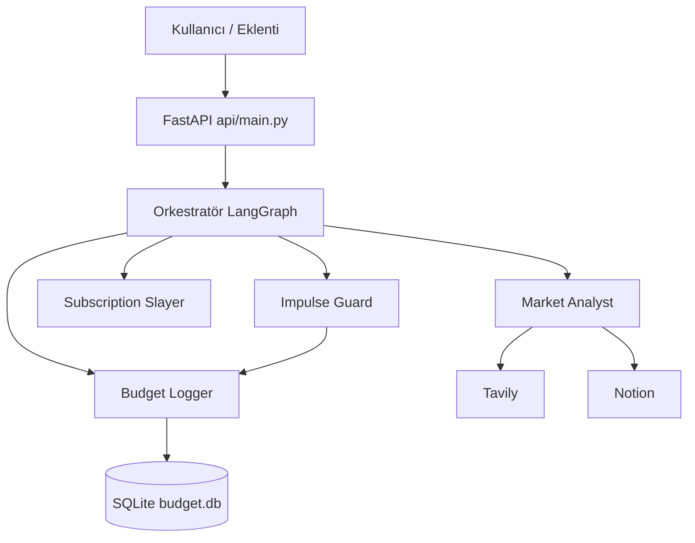

# FinGuard AI

Dört uzman ajan ve bir orkestratörle çalışan, **Gemini** tabanlı finans asistanı: pazar analizi, hayalet abonelik tespiti, dürtüsel alışveriş koçluğu ve doğal dille bütçe kaydı. **FastAPI** arka uç, web arayüzü ve isteğe bağlı **Chrome eklentisi** (Impulse Guard) içerir.

## Özellikler

| Ajan | Ne yapar? |
|------|-------------|
| **Market Analyst** | Tavily ile web araması, Gemini ile analiz, Notion’a rapor |
| **Subscription Slayer** | `data/mock_subscriptions.json` ile hayalet abonelik ve tasarruf özeti |
| **Impulse Guard** | Ürün + bütçe durumu; AL / BEKLE / alternatif önerisi |
| **Budget Logger** | Serbest metin harcama → SQLite (`data/budget.db`), aylık özet |
| **Orkestratör** | Kullanıcı niyetini sınıflandırır, doğru grafiği çalıştırır (`orchestrator.py`) |

## Gereksinimler

- Python 3.11+ (önerilir)
- Windows: `start.bat` için proje kökünde `venv`
- API anahtarları: aşağıdaki `.env` değişkenleri

## Kurulum

```powershell
cd <proje-dizini>
python -m venv venv
.\venv\Scripts\Activate.ps1
pip install -r requirements.txt
```

Proje kökünde `.env.example` dosyasını `.env` olarak kopyalayıp API anahtarlarınızı girin:

```env
GEMINI_API_KEY=...
TAVILY_API_KEY=...
NOTION_API_KEY=...
NOTION_PARENT_PAGE_ID=...
```

`NOTION_PARENT_PAGE_ID`, Market Analyst’in yeni sayfaları oluşturacağı Notion üst sayfanın ID’sidir.

## Çalıştırma

### Tek tık (Windows)

`start.bat` — sanal ortamda **uvicorn**’u ayrı pencerede başlatır ve tarayıcıda `http://127.0.0.1:8000/` açar.

### Manuel

```powershell
$env:PYTHONIOENCODING='utf-8'
python -m uvicorn api.main:app --host 127.0.0.1 --port 8000 --reload
```

- Arayüz: `http://127.0.0.1:8000/`
- Swagger: `http://127.0.0.1:8000/docs`
- Sağlık: `GET /health` (anahtarların tanımlı olup olmadığını özetler)

## API özeti

| Yöntem | Yol | Açıklama |
|--------|-----|----------|
| POST | `/chat` | Orkestratör + seçilen ajan |
| POST | `/analyze-product` | Chrome eklentisi / ürün analizi (Impulse Guard) |
| POST | `/subscriptions` | Abonelik özeti (mock veri) |
| GET | `/health` | Yapılandırma özeti |

Statik dosyalar: `GET /static/...` (`frontend/`).

## Chrome eklentisi (Impulse Guard)

1. Backend’in çalışıyor olması gerekir (`http://127.0.0.1:8000` — `start.bat` ile aynı adres).
2. Chrome → `chrome://extensions/` → Geliştirici modu → **Paketlenmemiş öğe yükle** → proje içindeki `chrome-extension` klasörünü seçin (üst klasör değil, doğrudan bu klasör).
3. Trendyol / Hepsiburada / Amazon TR ürün sayfasında sepete ekleme akışında eklenti API’yi çağırır.

**“Dosya taşınmış veya bozulmuş olabilir”:** Genelde `manifest.json`’da listelenen bir dosya eksikken veya proje klasörü taşındıktan sonra eklenti yenilenmeden oluşur. Çözüm: eklentiyi **Kaldır** → tekrar **Paketlenmemiş öğe yükle** ile güncel `chrome-extension` yolunu seçin. `manifest.json` içindeki `popup.html`, `background.js`, `content.js` dosyalarının hepsi bu klasörde olmalıdır.

**Trendyol / Hepsiburada’da tetiklenmiyorsa:** Eklentiyi `chrome://extensions/` üzerinden **Yenile** (↻) yapın (içerik betiği güncellenince şart). Ürün detay sayfasında **Sepete Ekle**’ye tıklayın; arka planda `http://127.0.0.1:8000` açık olmalı. Sorun sürerse sayfada F12 → Konsol’da `[FinGuard]` ile başlayan log var mı bakın.

## Mimari (özet)



## Geliştirici notları

- Ajan betikleri: `agents/`, araçlar: `tools/`, sprint planı ve geçmiş: `AGENT.md`, günlük özet: `WALKTHROUGH.md`.
- Abonelik demosu: `data/mock_subscriptions.json`.
- Bilgi grafiği çıktıları (varsa): `graphify-out/`.

## Lisans

MIT License — detaylar için [LICENSE](LICENSE) dosyasına bakın.
