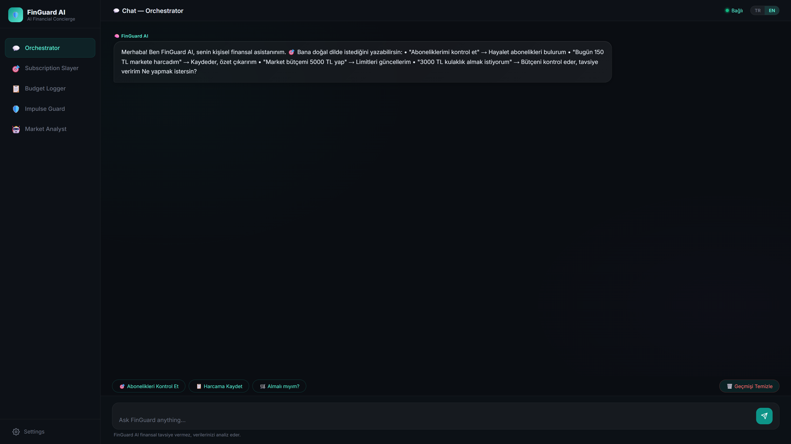
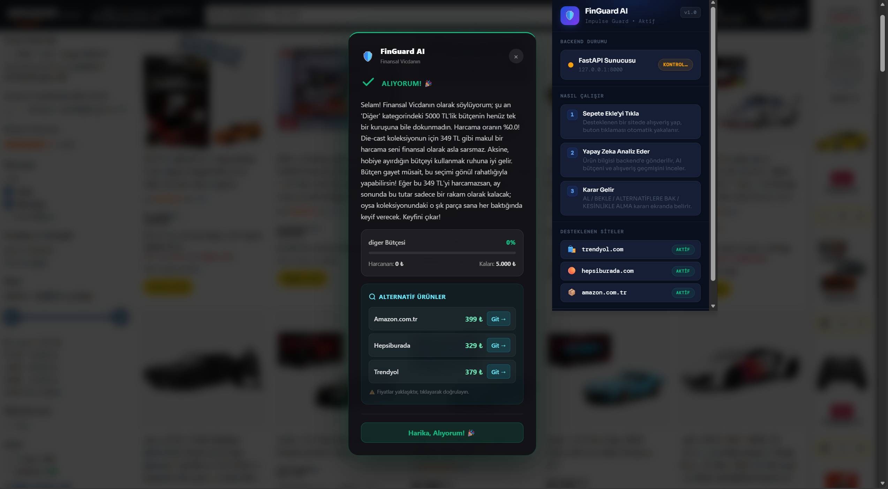
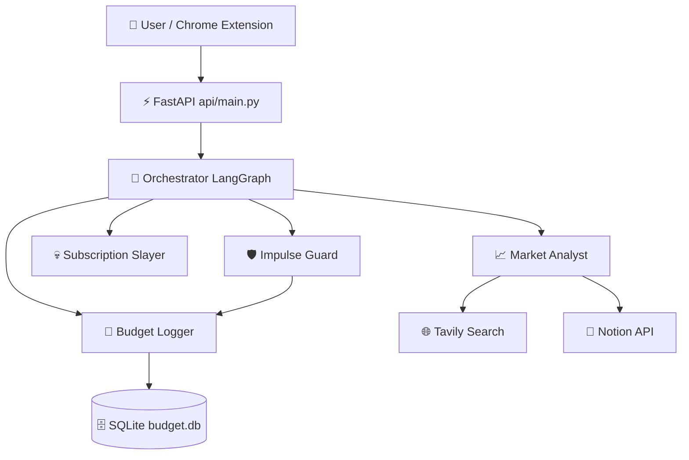

<div align="center">


# 🛡️ FinGuard AI

### *Your Intelligent Financial Concierge*

**A multi-agent AI platform that protects your wallet from impulse purchases, hunts ghost subscriptions, logs expenses in natural language, and delivers deep market research — all in one sleek interface.**

<br/>

[](https://python.org)
[](https://fastapi.tiangolo.com)
[](https://langchain-ai.github.io/langgraph/)
[](https://ai.google.dev)
[](LICENSE)

</div>

---

## ✨ Overview

FinGuard AI tackles the **four most common financial pain points** people face every day:

| 😩 The Problem | 🤖 FinGuard's Solution |
|---|---|
| *"I buy things and instantly regret it."* | **Impulse Guard** — your AI financial conscience |
| *"Forgotten subscriptions drain my budget."* | **Subscription Slayer** — expose & kill ghost subs |
| *"Budget apps are a pain to keep up with."* | **Budget Logger** — log expenses in plain language |
| *"Market research takes hours."* | **Market Analyst** — AI-generated reports in seconds |

All four agents run under a single **LangGraph orchestrator** that automatically classifies your intent and routes you to the right specialist — no manual selection required.

---

## 📸 Screenshots

<table>
  <tr>
    <td align="center"><b>🎯 Orchestrator Chat</b></td>
    <td align="center"><b>💸 Subscription Slayer</b></td>
  </tr>
  <tr>
    <td></td>
    <td></td>
  </tr>
  <tr>
    <td align="center"><b>📊 Budget Logger</b></td>
    <td align="center"><b>🔍 Market Analyst</b></td>
  </tr>
  <tr>
    <td></td>
    <td></td>
  </tr>
  <tr>
    <td align="center"><b>🛡️ Impulse Guard</b></td>
    <td align="center"><b>🧩 Chrome Extension</b></td>
  </tr>
  <tr>
    <td align="center"></td>
    <td align="center"></td>
  </tr>
</table>

---

## 🤖 The Agents

### 🛡️ Impulse Guard
Your AI-powered **financial conscience**. Describe what you want to buy — Impulse Guard checks your current budget, consults Gemini, and gives you a verdict: **GO / WAIT / NO**, along with a coaching message and budget-friendly alternatives.

Also works automatically via the **Chrome Extension** — intercepts the "Add to Cart" button on Trendyol, Hepsiburada, and Amazon TR before you spend.

### 💀 Subscription Slayer
Detects **ghost subscriptions** you forgot about. Calculates your total monthly bleed, ranks subscriptions by how long they've been unused, and generates an AI cancellation plan with free alternatives. Potentially saves you **thousands of TL per year**.

### 📒 Budget Logger
Log expenses the natural way — just type *"150 TL market, 45 TL coffee"*. Gemini parses it, categorizes it, and stores it in SQLite. View monthly breakdowns, category charts, and historical summaries without touching a spreadsheet.

### 📈 Market Analyst
Give it a topic — *"Turkish mechanical keyboard market 2025"* — and get a structured, sourced report in seconds: market size, growth trends, key competitors, risks, and opportunities. Reports are automatically saved to your **Notion** workspace.

---

## 🏗️ Architecture



All agent routing is handled by **LangGraph**'s conditional graph execution. Each agent is a self-contained LangChain tool chain — stateless except for Budget Logger (SQLite persistence).

---

## 🧰 Tech Stack

| Layer | Technology |
|-------|-----------|
| **LLM** | Google Gemini API |
| **Agent Framework** | LangGraph (stateful graph execution) |
| **Tool Chains** | LangChain + LangChain Google GenAI |
| **Web Search** | Tavily (market research) |
| **Persistence** | SQLite (`data/budget.db`) |
| **Backend** | FastAPI + Uvicorn (Python 3.11+) |
| **Frontend** | Vanilla HTML/CSS/JS (dark theme) |
| **Browser Extension** | Chrome Manifest v3 (content script + service worker) |
| **Reporting** | Notion API (auto-generated market reports) |

---

## 🚀 Quick Start

### 1. Clone & Set Up

```powershell
git clone https://github.com/<your-username>/FINGUARD.git
cd FINGUARD
python -m venv venv
.\venv\Scripts\Activate.ps1
pip install -r requirements.txt
```

### 2. Configure Environment

Copy `.env.example` to `.env` and fill in your API keys:

```env
GEMINI_API_KEY=your_gemini_api_key_here
TAVILY_API_KEY=your_tavily_api_key_here
NOTION_API_KEY=your_notion_api_key_here        # optional
NOTION_PARENT_PAGE_ID=your_notion_page_id_here # optional
```

> **Note:** `NOTION_PARENT_PAGE_ID` is the ID of the Notion page where Market Analyst will create sub-pages. Only required if you want reports saved to Notion.

### 3. Launch

**One-click (Windows):**
```powershell
.\start.bat    # starts uvicorn and opens the browser automatically
```

**Manual:**
```powershell
$env:PYTHONIOENCODING='utf-8'
python -m uvicorn api.main:app --host 127.0.0.1 --port 8000 --reload
```

Then open **http://127.0.0.1:8000** in your browser.

---

## 🔌 API Endpoints

| Method | Endpoint | Description |
|--------|----------|-------------|
| `POST` | `/chat` | Orchestrator — routes to the correct agent |
| `POST` | `/analyze-product` | Impulse Guard (called by Chrome extension) |
| `POST` | `/subscriptions` | Subscription Slayer analysis |
| `GET` | `/health` | Returns API key configuration status |
| `GET` | `/docs` | Interactive Swagger UI |

---

## 🧩 Chrome Extension (Impulse Guard)

The extension intercepts your shopping impulse **before** you add an item to cart.

**Setup:**
1. Make sure the backend is running at `http://127.0.0.1:8000`
2. Open `chrome://extensions/` → Enable **Developer mode**
3. Click **Load unpacked** → Select the `chrome-extension/` folder
4. Browse to Trendyol, Hepsiburada, or Amazon TR — the guard activates automatically on "Add to Cart"

**Supported sites:**
- ✅ Trendyol
- ✅ Hepsiburada  
- ✅ Amazon TR

> If the extension stops triggering, go to `chrome://extensions/` and click **Refresh** (↻). Check the browser console for `[FinGuard]` log messages if issues persist.

---

## 📁 Project Structure

```
FINGUARD/
├── api/
│   └── main.py              # FastAPI endpoints
├── agents/
│   ├── market_analyst.py    # Market research agent
│   ├── subscription_slayer.py
│   ├── impulse_guard.py     # Purchase decision agent
│   └── budget_logger.py     # Expense tracking agent
├── tools/
│   ├── web_search.py        # Tavily/Serper wrapper
│   └── notion_tool.py       # Notion page creation
├── chrome-extension/
│   ├── manifest.json
│   ├── content.js           # Cart button interceptor
│   ├── background.js
│   └── popup.html
├── frontend/                # Static web UI
├── data/
│   ├── budget.db            # SQLite expense store
│   └── mock_subscriptions.json
├── orchestrator.py          # LangGraph routing graph
├── config.py                # Category registry & settings
├── requirements.txt
├── start.bat                # One-click Windows launcher
└── .env.example             # Environment variable template
```

---

## 🙋 FAQ

**Do I need all four API keys to run?**  
Only `GEMINI_API_KEY` is required. Tavily is needed for Market Analyst, and Notion keys are optional (reports are returned as JSON even without them).

**Is my financial data sent anywhere?**  
No. Expense data stays in your local `budget.db` SQLite file. Only the text you type is sent to the Gemini API for analysis.

**Can I add more e-commerce sites to the extension?**  
Yes — add the domain to `host_permissions` in `manifest.json` and implement the corresponding selector block in `content.js`.

**Is this production-ready?**  
It's a fully functional prototype. A production deployment would need authentication, secure CORS policies, rate limiting, and real banking data integrations.

---

## 📄 License

This project is licensed under the **MIT License** — see the [LICENSE](LICENSE) file for details.

---

<div align="center">

**Built with ❤️ using Google Gemini, LangGraph, and FastAPI**

*FinGuard AI — because your wallet deserves a bodyguard.*

</div>
